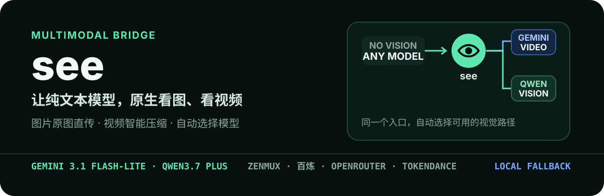

<p align="center">
  
</p>

`see` 是 [oil-oil/see-skill](https://github.com/oil-oil/see-skill) 的 **DeepSeek Harness 适配版**：让任何不支持多模态的模型（如 `deepseek-v4-flash`）直接查看图片和视频。图片默认交给 Qwen3.7 Plus；视频优先交给 Gemini 3.1 Flash-Lite，平台不可用时使用 Qwen3.7 Plus；全部云端失败时降级本地 OCR。

## 为什么需要它

在 DSH 里，纯文本路由的模型**无法读图**：`read_image` 工具会直接拒绝——

```text
Error: cannot read "..." as an image: model "deepseek-v4-flash" does not declare image input
```

拖进聊天框的图片对文本模型也是不可见的。`see` 的思路：不拒绝看图，把图片/视频路径转交给外部多模态模型或本地 OCR，再把文字结果读回给主模型——给"看不见的模型"配一双外接眼睛。安装 skill 不会更换右下角的主模型，`see` 只在查看媒体时调用视觉后端。

## 安装

### 方式一：把仓库放进技能根目录（推荐）

```bash
git clone https://github.com/<你的用户名>/<本仓库名>.git ~/.dsh/skills/see
# 或项目级（优先级更高）：
git clone https://github.com/<你的用户名>/<本仓库名>.git <项目根>/.dsh/skills/see
```

DSH 的 `skill-filesystem` 会自动发现 `<root>/<name>/SKILL.md`，`see` 随即出现在 `<available_skills>` 目录中，用户可直接输入 `/see` 触发。

### 方式二：运行安装脚本

```bash
python3 see/scripts/install_dsh.py            # 安装到 ~/.dsh/skills/see + 写入 ~/.dsh/AGENTS.md
python3 see/scripts/install_dsh.py --root project   # 项目级
python3 see/scripts/install_dsh.py --status   # 查看状态
python3 see/scripts/install_dsh.py --uninstall
```

安装脚本会把一条"不要拒绝看图"规则写入 `~/.dsh/AGENTS.md`（DSH 的 `agent-instructions` 会在每个会话注入它），让模型不再先说"不支持视觉"再停住。**新会话即生效**。

## 配置供应商

在**你自己的终端**里运行（交互式、隐藏输入 Key，Key 不会出现在聊天记录里）：

```bash
python3 see/scripts/onboard.py           # 选择供应商并保存 Key
python3 see/scripts/onboard.py --status  # 查看配置与本地后端
```

或直接使用环境变量（优先级最高）：

```bash
export SEE_PROVIDER=zenmux
export ZENMUX_API_KEY=你的Key
```

没有多模态 Key 也能用：onboard 时选择 `local` 即可（仅图片，走系统视觉/OCR）。

| 供应商 | 默认模型 | Key 变量 |
|---|---|---|
| ZenMux | `qwen/qwen3.7-plus` | `ZENMUX_API_KEY` |
| 百炼 | `qwen3.7-plus` | `DASHSCOPE_API_KEY` |
| OpenRouter | `qwen/qwen3.7-plus` | `OPENROUTER_API_KEY` |
| TokenDance | `qwen3.7-plus` | `TOKENDANCE_API_KEY` |
| 本地 | 系统视觉 / OCR | 不需要 |

视频自动选择：ZenMux/OpenRouter 默认 `google/gemini-3.1-flash-lite`（完整视频+音频）；百炼/TokenDance 默认 `qwen3.7-plus`。视频需要任一云端 Key。

## 使用

向模型发送本地路径或 URL 即可，或显式输入 `/see`：

```text
使用 see 查看 /Users/me/Desktop/error.png
识别 /path/to/error.png 里的报错，并告诉我怎么修
并行查看 a.png、b.png、c.png
比较 before.png 和 after.png 的界面变化
总结 /path/to/demo.mp4 的内容
```

模型侧的标准调用（结果写入当前工作区，避开沙箱写入限制）：

```bash
SEE_OUTPUT_DIR=. scripts/see.sh screenshot.png
SEE_OUTPUT_DIR=. scripts/see.sh error.png --task "识别报错并给出修复建议"
SEE_OUTPUT_DIR=. scripts/see.sh a.png b.png c.png
SEE_OUTPUT_DIR=. scripts/see.sh --together before.png after.png --task "比较界面变化"
SEE_OUTPUT_DIR=. scripts/see.sh demo.mp4
scripts/see.sh a.png -o see-result.md
```

成功后 stdout 只输出一行 `output_path=/absolute/path/result.md`，用 `read` 工具读取该 Markdown 即可（含 frontmatter：实际后端、模型、单图/并行/联合模式、每次路由是否成功）。

## DSH 沙箱注意事项（workspace-write 模式）

- **网络不受限**：云端视觉 API 调用正常。
- **写入受限**：结果必须写进工作区（`SEE_OUTPUT_DIR=.` / `-o`）或 `/tmp`；默认的 `~/.local/share/see/outputs` 会被沙箱拒绝。
- **读取不受限**：任意本地图片路径可读。
- macOS 下 `swiftc` 若因沙箱无法编译运行时，会自动回退到 `swift` 解释模式或 `osascript`（JXA）；Vision 底层 E5RT 缓存被沙箱拦截时打印的杂音不会影响 JSON 结果（`run_json` 已做健壮解析）。

## 与上游的差异

| 上游（Codex） | 本仓库（DSH） |
|---|---|
| 靠 `安装 ... skill` 命令安装 | 放入 `~/.dsh/skills/see` 或项目 `.dsh/skills/see`，自动发现 |
| 拒绝覆盖写入 `~/.codex/AGENTS.md` | 写入 `~/.dsh/AGENTS.md`（DSH `agent-instructions` 每会话注入） |
| 显式触发 `$see` | 用户手势 `/see` + 目录描述自动触发 |
| onboard 交互式输 Key | 机制不变，但 Key 配置在**用户自己的终端**运行（DSH 的 bash 无 TTY） |
| 结果写 `~/.local/share/see/outputs` | 调用时带 `SEE_OUTPUT_DIR=.` / `-o` 写进工作区 |

核心脚本（`parse_media.py`、`ocr_*`）与上游一致，仅做了少量健壮性补丁：`run_json` 容忍系统框架的 stdout 杂音（如沙箱下的 E5RT 报错）、URL 下载对带媒体扩展名的 `application/octet-stream` 响应放行。

## 文件结构

```text
see/
├── SKILL.md                # DSH 格式 frontmatter + 使用说明
└── scripts/
    ├── see.sh              # 入口（转调 parse_media.py）
    ├── parse_media.py      # 核心：路由/并行/视频压缩/本地 OCR
    ├── onboard.py          # 供应商与 Key 配置（AGENTS 写入 ~/.dsh/AGENTS.md）
    ├── install_dsh.py      # DSH 安装/状态/卸载
    └── ocr_macos.{swift,js} / ocr_windows.ps1
tests/                      # 单元测试（SKILL.md frontmatter、AGENTS 幂等、本地 OCR）
```

## 测试

```bash
python3 -m unittest discover -s tests -v
```

## License

[MIT](./LICENSE)。基于 [oil-oil/see-skill](https://github.com/oil-oil/see-skill)（MIT © 2026 oil-oil）适配。
